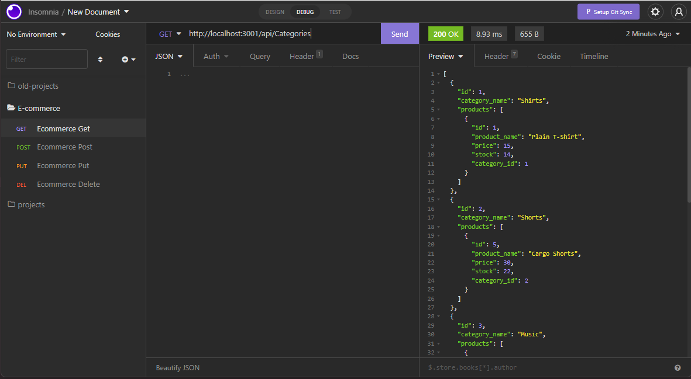

# E-commerce Back End

## Description
 This application serves as a database for an e-commerce website. It uses MySQL to create and seed the database, sequelize to create assoications, and Express.js API to allow Sequelize to communicate with the MySQL database. 

## Table of Contents 
* [Installation](#Installation)
* [Usage](#Usage)
* [Technology](#Technology)
* [Questions](#Questions)
* [License](license)

***
## Installation 
To set up this application, follow these instructions: 
1. Clone this repository.
2. Create a .env file and provide your MySQL login information. The information you provide should include the following: 

* DB_NAME=ecommerce_db
* DB_USER=[your username]
* DB_PW=[your password]

3. Once you have finished inputting your information, open the command line and run the code "npm install". 
4. Once the installation is complete, go into MySQL and run "source db/schema.sql".
5. You can then seed the database by running "npm run seed". 
5. To start the application, type "node server.js" in the root of the directory of the project. 

## Usage
Click this video to view a demonstration of this application.

[Video Demo](https://user-images.githubusercontent.com/95240889/167336489-7a3e882d-21fb-484f-bcaa-8e0a043e85c3.mp4)

## Technology
* HTML5
* CSS 
* JS
* MySQL
* Sequelize
* Express.js

### Questions
If you have any questions or concerns regarding this project, feel free to reach out to Victoria Rice at vrice360@gmail.com.

### Author
[Victoria Rice](https://github.com/vtori37)

--- 

## License 
https://opensource.org/licenses/MIT

Copyright © 222 Victoria Rice

Permission is hereby granted, free of charge, to any person obtaining a copy
of this software and associated documentation files (the "Software"), to deal
in the Software without restriction, including without limitation the rights
to use, copy, modify, merge, publish, distribute, sublicense, and/or sell
copies of the Software, and to permit persons to whom the Software is
furnished to do so, subject to the following conditions:

The above copyright notice and this permission notice shall be included in all
copies or substantial portions of the Software.

THE SOFTWARE IS PROVIDED "AS IS", WITHOUT WARRANTY OF ANY KIND, EXPRESS OR
IMPLIED, INCLUDING BUT NOT LIMITED TO THE WARRANTIES OF MERCHANTABILITY,
FITNESS FOR A PARTICULAR PURPOSE AND NONINFRINGEMENT. IN NO EVENT SHALL THE
AUTHORS OR COPYRIGHT HOLDERS BE LIABLE FOR ANY CLAIM, DAMAGES OR OTHER
LIABILITY, WHETHER IN AN ACTION OF CONTRACT, TORT OR OTHERWISE, ARISING FROM,
OUT OF OR IN CONNECTION WITH THE SOFTWARE OR THE USE OR OTHER DEALINGS IN THE
SOFTWARE.
